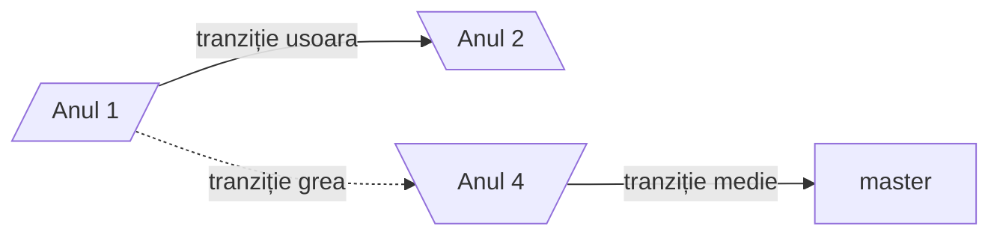

# Diagrame de tip `Flowchart`
# Diagrame de tip _Flowchart_



```
flowchart LR
A[/Anul 1/] -->|tranziție usoara| B[\Anul 2\]
A -.->|tranziție grea| C[\Anul 4/]
C -->|tranziție medie| D[master]
```

**De retinut:**
-Diagramele _flowcharte_ au noduri si conectori
-Nodurile au:
 -**forma** (data de parantezele folosite la descrierea _nodului_)
 -ID (șirul folosit in afara descrierii nodului}
 -Descrierea (textul ce apare in caseta nodului si care este implementat in interiorul diferitelor tipuri de paranteze - ce decid forma casetei nodului)
 - Conectorii au:
   -Diferite tipuri de săgeți sau chiar pot activa fără sageti
   -Diferite tipuri delinii:
     -`-->` linie continua (săgeată dreapta)
     - ` <--` linie continua (săgeți stanga)
     - `<-->` linie continua (săgeată stânga si dreapta)
     - `==>` linie îngroșat  cu săgeată spre dreapta
  
       
flowchart LR
A & B --> C & D & E --> F & G


# Diagramă de tip _Timeline_
```mermaid
timeline
title "My Timeline"
Section "Secțiunea 1"
2023-2024
          : am luat la facultate
          : am luat contact cu mediul academic
2024-2025
          : am terminat anul I
          : am făcut practica 
Section "Sectiunea 2"
2025-2026
          : am făcut practica la Fotogrammetrie
2026-2027
          : am anul terminal IV
          : Am terminat facultatea
 
